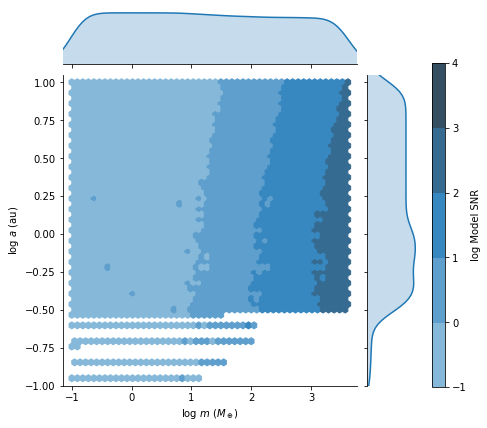
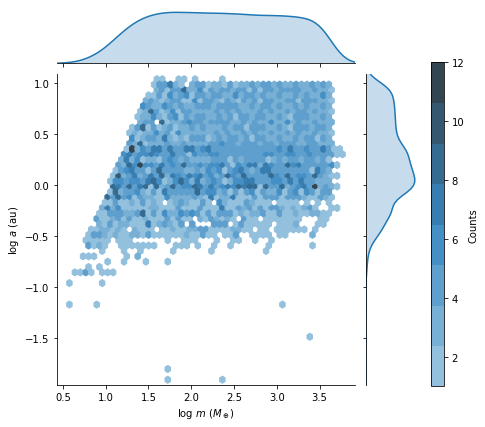
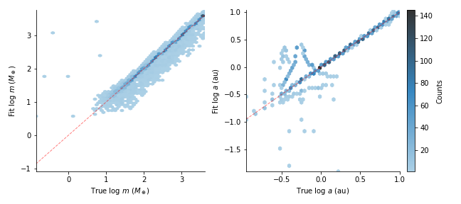

# exoplanet_distributions
Fitting the synthetic radial velocity curves of a distribution planets; please see the [paper](misc/exo_project_paper.pdf) for an in-depth explanation. Some choice figures are displayed below.

  
An example radial velocity curve showing the intrinsic lightcurve, the 'observed' data, and a fit to the data.

  
The synthetic intrinsic distribution, color-coded by the signal-to-noise ratio (SNR) of the best-ft model.

  
The resulting 'observed' produced by fitting the lightcurves of all systems in the intrinsic distribution.

  
A histogram comparing the observed and intrinsic distribution.

  
A correlation plot showing the pairwise relationships between the true and fit values for $m$ and $a$. The dashed red line traces a one-to-one correspondence between the true value and the fit.
